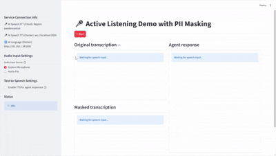

# Active Listening with PII Marking Demo
This demo integrates the Azure Speech service (in connected or disconnected containers) to transcribe voice and synthetize agent's response, Azure AI Language (also in connected or disconnected containers) to mask PII, and an AI Foundry Agent with a knowledge base to provide answers and suggestions to the human agent during a customer conversation.

## Prerequisites
+ An Azure subscription, with [access to Azure OpenAI](https://aka.ms/oai/access).
+ An instance of Azure Speech Service.
+ An instance of Azure Language Service.
+ An Azure AI Foundry service with an agent for answering and provicing advice

Sample of generic agent instructions with a knowledge base:
```
You are a hidden AI assistant monitoring a live conversation between a customer and a human agent at Consoto's contact center. 
Your goal is to: Understand the customer's questions, requests, and concerns in real time. Provide the human agent with helpful suggestions, accurate answers, and relevant information. Propose personalized product offers, services, or any useful data that can improve customer satisfaction and increase cross-selling or upselling opportunities.
Instructions: Analyze the conversation context carefully. Respond only with information that the human agent can use to assist the customer effectively. If there is more than one information that matches the user’s query, ask clarification questions to identify the specific content being requested. If the customer expresses frustration or dissatisfaction, suggest empathetic responses and possible solutions. If the customer shows interest in financial products (loans, credit cards, savings), recommend suitable offers or promotions. Never address the customer directly; your output is for the agent only.
Output format: Summarize the customer's intent in one sentence. You **MUST** use the tools to retrieve the context to generate the answer to the customer's query.
Don't generate your response using your own knowledge.
If you can't find a good content to answer the user's query, just response "I don't have information to answer your question.".
Provide 2-3 recommended responses to the customer's question or actions for the agent. If applicable, suggest one relevant product or offer.
You **MUST** use the tools to retrieve the context to generate your answer.
```

I used Python 3.13.9, [Visual Studio Code with the Python extension](https://code.visualstudio.com/docs/python/python-tutorial).

## Set up a Python virtual environment in Visual Studio Code

1. Open the Command Palette (Ctrl+Shift+P).
2. Search for **Python: Create Environment**.
3. Select **Venv**.
4. Select a Python interpreter. Choose 3.13 or later.
5. Select requirements.txt to install dependencies

It can take a minute to set up. If you run into problems, see [Python environments in VS Code](https://code.visualstudio.com/docs/python/environments).


## AI Speech and PII masking running on containers
If you need the Speech-to-Text function and Personally Identifiable Information (PII) masking to be performed on-premises to avoid sending sensitive information to the cloud.
These documents describes the details for both connected and disconnected containers:
+ [Install and run Speech containers with Docker](https://learn.microsoft.com/en-us/azure/ai-services/speech-service/speech-container-howto)
+ [Install and run (PII) Detection containers](https://learn.microsoft.com/en-us/azure/ai-services/language-service/personally-identifiable-information/how-to/use-containers)

Below I’ll explain the main steps to configure the images in Docker containers.

First you have to install and run docker in the computers you are going to configure the containers: [Docker](https://docs.docker.com/)

### Install and run Speech-to-Text container:
The STT container are language dependent. The image for US English is ```mcr.microsoft.com/azure-cognitive-services/speechservices/speech-to-text```, but you can find the one you need [here](https://mcr.microsoft.com/artifact/mar/azure-cognitive-services/speechservices/speech-to-text/tags). The language ID at the end of image name identifies the language; for example, for Turkish, the name ends with 'tr-tr'.

* Get the container:

```docker pull mcr.microsoft.com/azure-cognitive-services/speechservices/speech-to-text:latest```

* Run the container:

```docker run --rm -it -p 5000:5000 --memory 8g --cpus 1 mcr.microsoft.com/azure-cognitive-services/speechservices/speech-to-text:latest Eula=accept Billing=<https://YOUR-SPEECH-OR-MULTIAI-RESOURCE-NAME.cognitiveservices.azure.com/> ApiKey=<YOUR-SPEECH-APIKEY>```

### Install and run PII Detection container:
* Get the container:

```docker pull mcr.microsoft.com/azure-cognitive-services/textanalytics/pii:latest```

* Run the container:

```docker run --rm -it -p 5000:5000 --memory 8g --cpus 1 mcr.microsoft.com/azure-cognitive-services/textanalytics/pii:latest Eula=accept Billing=https://<YOUR-AILANGUAGE-RESOURCE-NAME>.cognitiveservices.azure.com/ ApiKey=<YOUR-AILANGUAGE-APIKEY>```

### Install and run Text-to-Speech container:
The TTS container are language and voice dependent. The image for US English is ```mcr.microsoft.com/azure-cognitive-services/speechservices/neural-text-to-speech```, but you can find the one you need [here](https://mcr.microsoft.com/artifact/mar/azure-cognitive-services/speechservices/neural-text-to-speech/tags). The language and voice IDs at the end of image name identifies the language and voice name; for example, for Turkish and 'Emel Neural', the name ends with 'tr-tr-emelneural'.

* Get the container:

```docker pull mcr.microsoft.com/azure-cognitive-services/speechservices/neural-text-to-speech:latest```

* Run the container:

```docker run --rm -it -p 5000:5000 --memory 8g --cpus 1 docker pull mcr.microsoft.com/azure-cognitive-services/speechservices/neural-text-to-speech:latest Eula=accept Billing=<https://YOUR-SPEECH-OR-MULTIAI-RESOURCE-NAME.cognitiveservices.azure.com/> ApiKey=<YOUR-SPEECH-APIKEY>```

### Configure STT and PII Detection connected containers on Azure:
Just for demo purposes (because for a real project it makes not sense), in the folloing document I explain how to deploy the STT and PII Detection images in Azure Container: 

## Environment Configuration

Create a `.env` file in the root directory of your project with the following content. You can use the provided [`.env-sample`](.env-sample) as a template:

**Azure Speech Service configuration variables**
```
SPEECH_KEY=<YOUR-SPEECH-KEY>
SPEECH_REGION=<YOUR-SPEECH-REGION>
SPEECH_LOCAL_URL=ws://localhost:5000
SPEECH_LANGUAGE=en-US
```

**Azure AI Language Service configuration variables**
```
AI_SERVICE_ENDPOINT=https://<YOUR-AI-SERVICE-ENDPOINT>
AI_SERVICE_KEY=<YOUR-AI-SERVICE-KEY>
AI_LOCAL_URL=http://localhost:5000
TEXT_LANGUAGE=en
```

**Azure AI Foundry Service configuration variables**
```
PROJECT_ENDPOINT=https://<YOUR-AI-FOUNDRY-SERVICE-NAME>.services.ai.azure.com/api/projects/<YOUR-PROJECT-NAME>
AGENT_ID=<YOUR-AGENT-ID>
```

**Text-to-Speech configuration (optional)**
```
TTS_VOICE=en-US-JennyNeural
```
Available voices: `en-US-JennyNeural`, `en-US-GuyNeural`, `es-ES-ElviraNeural`, `es-ES-AlvaroNeural`, etc.
See [Azure Speech Service voice list](https://learn.microsoft.com/en-us/azure/ai-services/speech-service/language-support?tabs=tts) for more options.

**Use AI Speech Speech-to-Text (STT), Text-to-Speech (TTS) and AI Language in Containers or Not**
```
DOCKER_STT=true
DOCKER_TTS=true
DOCKER_AI=true
```

## Run the demos:

**Option 1: Demo of audio processing from system microphone without a web interface**

run `python active-listening.py`

**Option 2: Demo of audio conversation processing from audio file without a web interface**

run `python active-listening-conversation.py`

**Option 3: Demo of audio processing from system microphone, browser microphone or audio file with a web interface**

run `streamlit run active-listening-app.py`

